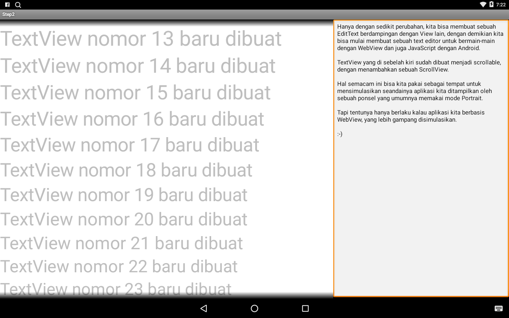
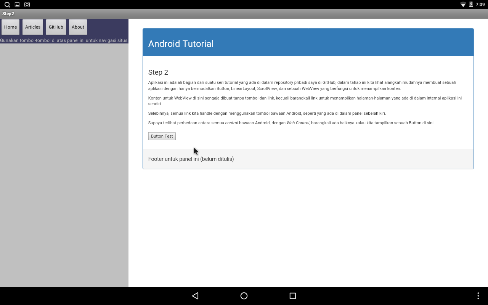
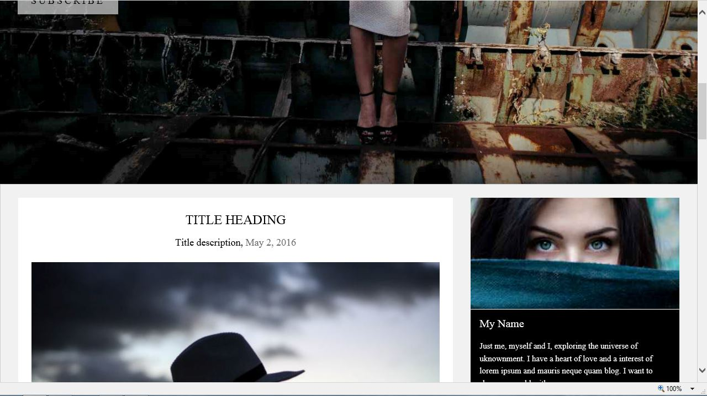

# Step3

Bereksperimen sedikit dengan menambahkan sebuah EditText di sebelah kanan.



Saya sedang membayangkan kalau yang di sebelah kanan itu adalah sebuah HTML, 
dan yang sebelah kiri adalah sebuah **Text Editor** yang sedang kita pakai untuk membuatnya, 
kelihatannya seperti ide yang baik.

Caranya gampang sekali, dengan mengubah _redundant loop_ yang membuat sejumlah TextView untuk sekedar demo itu
menjadi inisialisasi EditText, seperti yang di bagian bawah Main.java
```java
EditText et = new EditText(this);

// Dalam hal ini kita memaksakan bahwa EditText ini akan menempati 50% dari total lebar dari PARENT
// yang dalam hal ini adalah _root_ layout.
et.setLayoutParams(new LayoutParams(LayoutParams.MATCH_PARENT, LayoutParams.MATCH_PARENT, 0.5f));

// Kalau berikut ini tidak kita tambahkan, maka cursor akan ditempatkan di tengah-tengah text box,
// dan penampilannya akan lucu-lucu menjengkelkan.
et.setGravity(Gravity.TOP);

// setelah ini barulah kita menempatkan WebView, di bagian kanan layar
```

Implementasinya kurang lebih seperti gambar berikut:



Saya rasa sekarang saatnya mengupload sebuah _release_ untuk branch ini, supaya Anda maupun saya bisa mengevaluasi
hasilnya. Karena kita mengijinkan JavaScript melalui WebSettings dengan setJavaScriptEnabled(true), maka sekaligus tombol
**Button Test** di atas saya buat untuk contoh bahwa JavaScript berfungsi dengan baik dari dalam WebView.

Aplikasi tersebut, dalam tahap sekarang ini, hanya akan tampil dengan baik kalau kita menggunakan sebuah komputer (atau mungkin sebuah tablet),
dan kalau ditampilkan oleh sebuah ponsel panel di sebelah kanan tidak akan terlihat.

Hal ini karena desain kita tidak memperhatikan apa yang dinamakan **Responsive Design**.

Untuk mendukung UI yang lebih fleksibel digunakan dengan perangkat-perangkat yang berbeda, kita sebaiknya menggunakan
**Fragment**, sebuah skenario baru dari android, tetapi ini belum akan kita bahas di sini sekarang, supaya kita tetap fokus 
pada penggunaan komponen-komponen dasar android.

Untuk mengetahui lebih jelas mengenai ini, sebaiknya membaca sendiri [situs resmi android!](https://developer.android.com/training/basics/fragments/index.html)

Sebailknya, tanpa harus menggunakan fragment, kita bisa mendukung berbagai perangkat, termasuk perangkat ponsel yang relatif kecil,
dan oleh pengguna cenderung ditempatkan dalam _portrait_ view hanya dengan mengandalkan sebuah WebView, dengan konten yang dibuat
untuk mendukung _responsive design_, seperti bisa dilihat dalam contoh berikut, katakanlah kita memiliki sebuah blog seperti 
contoh yang diambil dari template W3CSS berikut:


Dan kita menampilkan blog tersebut di dalam aplikasi android kita di atas, tanpa modifikasi apapun, kecuali menambahkan isi
template tersebut sebagai asset, dan memanggil halaman terkait, maka penampilannya akan seperti:


